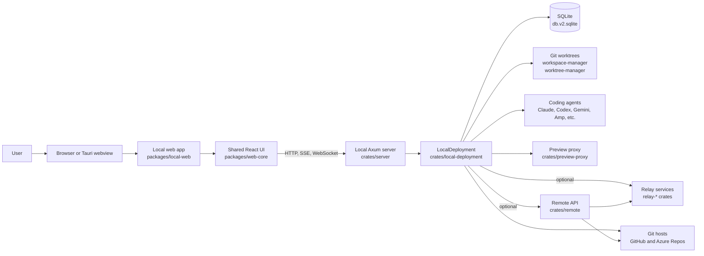
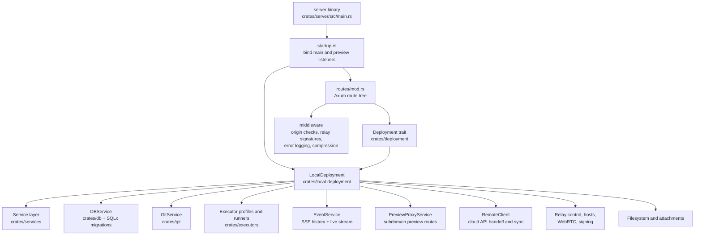
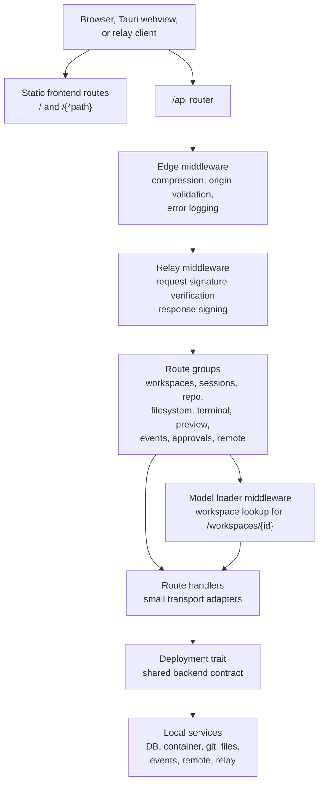
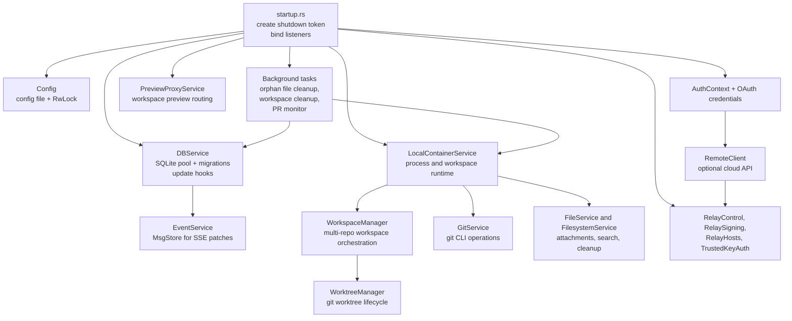
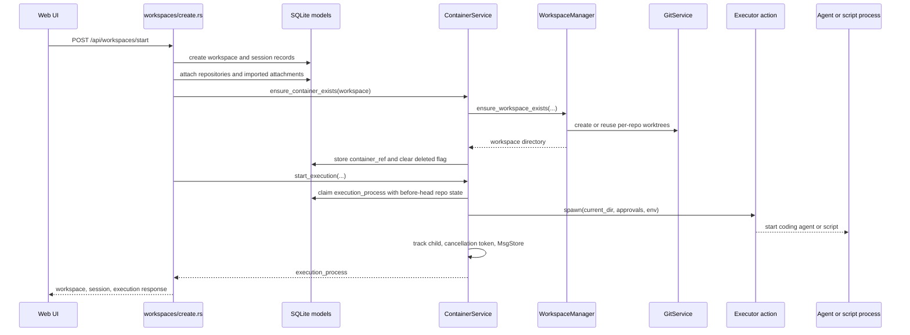
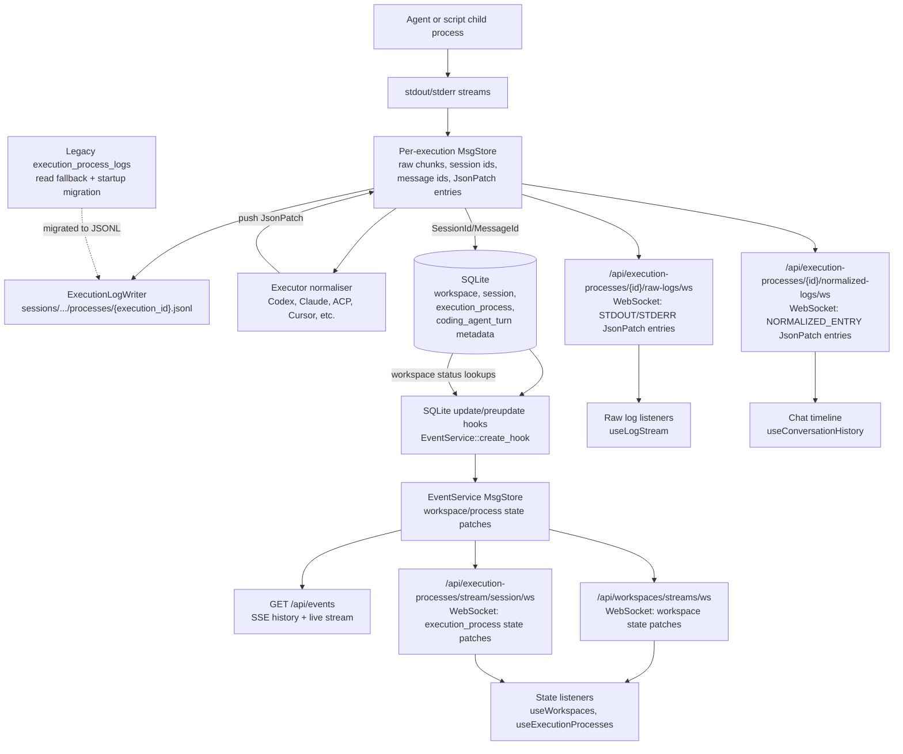
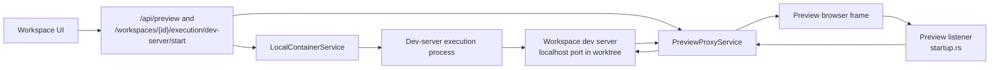
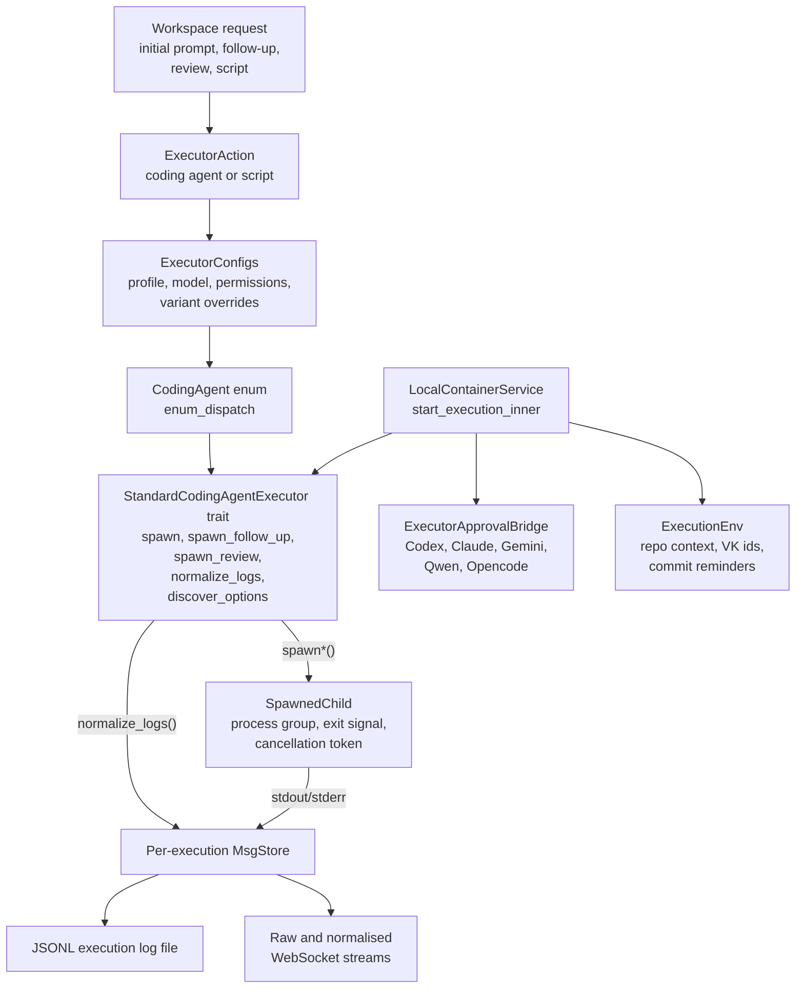
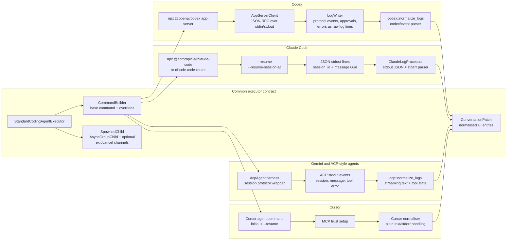

## Overview

Vibe Kanban is a local-first application with optional cloud and relay services. The local app serves a React frontend, exposes an Axum API, stores state in SQLite, manages git worktrees, runs coding agents as child processes, and proxies preview traffic from workspace dev servers.

The remote deployment adds organisation, issue, attachment, GitHub App, ElectricSQL, and relay-facing services for Vibe Kanban Cloud. Local installations can connect to those services when the shared API and relay endpoints are configured.

## Backend architecture

The backend is split between transport, deployment wiring, service logic, and persistence. `crates/server` owns startup and Axum routing. `crates/deployment` defines the shared `Deployment` trait used by routes and services. `crates/local-deployment` builds the concrete local deployment by initialising configuration, SQLite, git, file storage, event streaming, approvals, executor state, relay state, and preview services.

### Backend request layers

Most HTTP traffic enters through the Axum router in `crates/server`. The route
tree keeps transport concerns at the edge, loads request-scoped models where
needed, and delegates all durable behaviour through the `Deployment` interface.

### Local deployment composition

`LocalDeployment::new` wires long-lived services once at startup. The same
deployment instance is cloned into every route, so handlers share service
handles while each service keeps its own internal locks, background tasks, and
connection pools.

### Workspace creation and execution flow

Creating and starting a workspace crosses three boundaries: the route creates
durable database records, the container service claims an execution, and the
local container implementation prepares worktrees before spawning the selected
agent or script process.

### Execution logs, UI streams, and state events

Execution output uses a per-process `MsgStore` as the live fan-out point. Raw
stdout and stderr are persisted to local JSONL files under the asset directory,
while executor-specific normalisers read the same stream and push conversation
patches back into the `MsgStore`. UI listeners are split by payload: raw log
viewers subscribe to raw stdout/stderr patches, the chat timeline subscribes to
normalised conversation patches for coding-agent and review processes, and
workspace/process list views subscribe to state patches derived from SQLite
hooks. SQLite remains the source of durable execution metadata and the legacy
fallback for logs migrated from older versions.

The main listener split is:

| Frontend listener | Endpoint and protocol | Payload shape | Intended data |
| --- | --- | --- | --- |
| `useLogStream` in process, script, and preview log views | `/api/execution-processes/{id}/raw-logs/ws` over WebSocket | `LogMsg::JsonPatch` entries whose values are `STDOUT` or `STDERR`, followed by `finished` | Raw execution logs for scripts, dev servers, and process-detail views. This stream does not carry normalised chat entries. |
| `useConversationHistory` for workspace chat timeline | `/api/execution-processes/{id}/normalized-logs/ws` over WebSocket | `LogMsg::JsonPatch` entries whose values are normalised conversation entries, followed by `finished` | Agent/review conversation history: assistant text, tool use, token usage, todos, questions, errors, and related normalised entries. Script processes are routed to the raw-log stream instead. |
| `useExecutionProcesses` via `ExecutionProcessesProvider` | `/api/execution-processes/stream/session/ws?session_id=...` over WebSocket | Initial `replace /execution_processes`, `Ready`, then add/replace/remove patches keyed by process id | Execution-process metadata for a session: status, timestamps, executor action, run reason, soft-delete state, and similar model fields. |
| `useWorkspaces` via `WorkspaceProvider` | `/api/workspaces/streams/ws?archived=...` over WebSocket | Initial `replace /workspaces`, `Ready`, then workspace add/replace/remove patches | Workspace list/cache state, including computed workspace status. |
| Legacy/global event consumers | `/api/events` over SSE | `LogMsg` encoded as SSE events, normally JSON patches from the EventService store | Global history + live state events from the SQLite hook bus. Current React state hooks use the filtered WebSocket endpoints above rather than `EventSource`. |

The SQLite update stream is not an execution-log stream. `DBService` installs
SQLite update and preupdate hooks for `workspaces`, `execution_processes`, and
`scratch`. Those hooks fetch the changed row, convert it into JSON Patch
operations, and push the patch into the `EventService` `MsgStore`. Filtered
WebSocket routes then expose per-view slices of that patch bus, and `/api/events`
exposes the same store as SSE for global consumers.

Running execution-log streams read from memory first. If the process still has a
live `MsgStore`, both raw and normalised endpoints replay its in-memory history
and then continue with live broadcast messages. Once the live store is gone, the
raw endpoint reads the process JSONL file from disk and appends `finished`; if no
file exists it falls back to legacy `execution_process_logs` rows. Historical
normalised replay also starts from the JSONL raw messages, populates a temporary
`MsgStore`, reruns the executor normaliser, deduplicates the resulting patches,
and then emits `finished`.

### Preview proxy flow

Preview traffic is separate from normal API traffic. The main server exposes
preview configuration APIs, while the preview listener uses
`PreviewProxyService` to route browser requests to the dev-server process
running inside a workspace.

## Executor architecture

Executors are adapters around coding-agent CLIs and protocols. The backend
stores the desired action as an `ExecutorAction`, resolves it through
`ExecutorConfigs`, and then calls the `StandardCodingAgentExecutor` trait
implemented by each agent. The container service owns process lifecycle,
workspace paths, approval bridges, environment injection, log capture, and
durable execution records.

### Executor adapters

Most adapters share the same container contract, but differ in how they launch
the agent, resume sessions, request approvals, and translate native output into
normalised conversation entries.

Codex runs as an app-server subprocess and uses a JSON-RPC client inside the
executor adapter. The adapter starts or forks Codex threads, forwards approval
requests through Vibe Kanban's approval bridge, writes Codex protocol events
back into the captured log stream, and normalises `codex/event` notifications
for the conversation UI.

Claude Code runs as a CLI process that emits structured JSON lines on stdout.
The Claude adapter builds initial and resumed commands, supports
`--resume-session-at` for resetting to a previous message, extracts Claude
session and message identifiers from the JSON stream, and normalises both
stdout JSON and stderr into conversation entries.

Gemini uses the shared ACP harness and normaliser. The harness manages
agent-client-protocol sessions, while the ACP normaliser turns session,
message, tool-call, and error events into streaming conversation patches.

Cursor follows the same trait contract with Cursor-specific command building,
resume arguments, MCP trust setup, and log normalisation. Its normaliser handles
plain text and stderr-oriented output, including login and setup errors.

## Frontend architecture

The detailed frontend architecture, including app shells, feature modules, local
and remote entrypoints, connection ownership, and workspace data flows, lives in
[Frontend architecture](frontend-architecture.md).

## Runtime flow

1. The server starts, creates the asset directory, migrates SQLite, initialises `LocalDeployment`, and binds the main API listener and preview proxy listener.
2. The frontend loads from the local server in production or from Vite in development.
3. UI features call `/api` routes for projects, workspaces, sessions, git operations, previews, approvals, terminal access, and configuration.
4. Backend routes delegate through the `Deployment` trait to database, git, filesystem, executor, event, preview, remote, and relay services.
5. A workspace creates or reuses git worktrees, starts agent or script processes, stores execution metadata in SQLite, persists raw execution logs as JSONL files, and streams raw logs, normalised conversation patches, and state changes back to the UI.
6. Optional cloud configuration enables remote project, issue, host pairing, relay, and sync flows through `crates/remote` and the relay crates.
