## Overview

Vibe Kanban is a local-first application with optional cloud and relay services. The local app serves a React frontend, exposes an Axum API, stores state in SQLite, manages git worktrees, runs coding agents as child processes, and proxies preview traffic from workspace dev servers.

The remote deployment adds organisation, issue, attachment, GitHub App, ElectricSQL, and relay-facing services for Vibe Kanban Cloud. Local installations can connect to those services when the shared API and relay endpoints are configured.

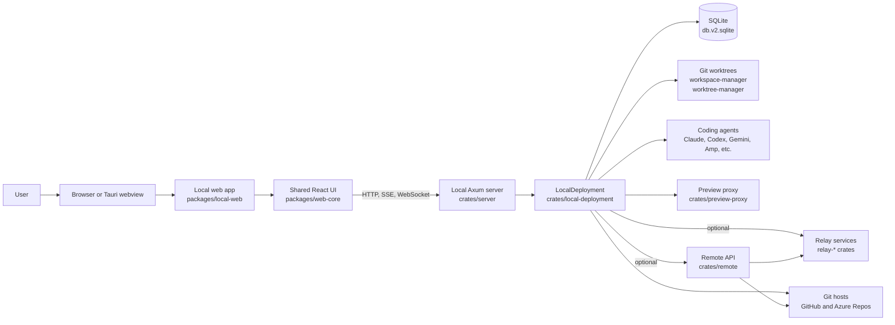

## Backend architecture

The backend is split between transport, deployment wiring, service logic, and persistence. `crates/server` owns startup and Axum routing. `crates/deployment` defines the shared `Deployment` trait used by routes and services. `crates/local-deployment` builds the concrete local deployment by initialising configuration, SQLite, git, file storage, event streaming, approvals, executor state, relay state, and preview services.

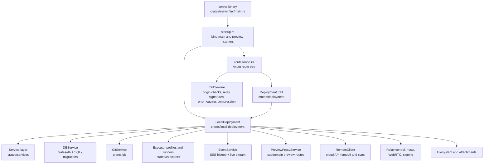

### Backend request layers

Most HTTP traffic enters through the Axum router in `crates/server`. The route
tree keeps transport concerns at the edge, loads request-scoped models where
needed, and delegates all durable behaviour through the `Deployment` interface.

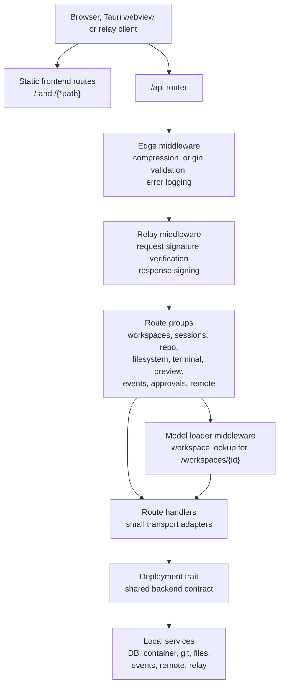

### Local deployment composition

`LocalDeployment::new` wires long-lived services once at startup. The same
deployment instance is cloned into every route, so handlers share service
handles while each service keeps its own internal locks, background tasks, and
connection pools.

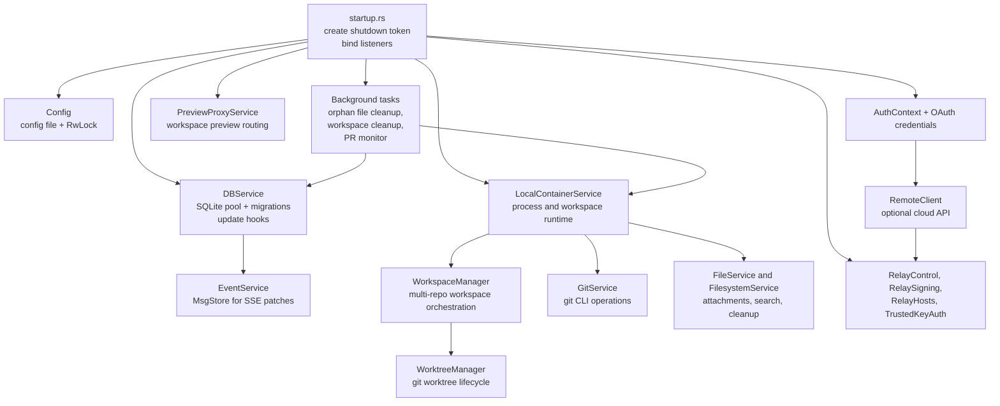

### Workspace creation and execution flow

Creating and starting a workspace crosses three boundaries: the route creates
durable database records, the container service claims an execution, and the
local container implementation prepares worktrees before spawning the selected
agent or script process.

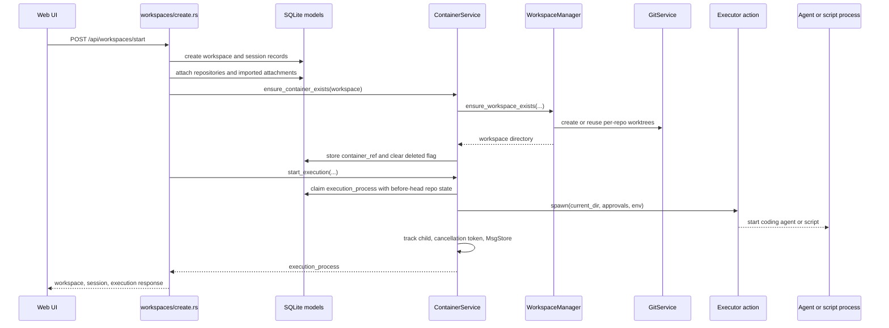

### Execution logs, UI streams, and state events

Execution logs and model-state events use different buses. Each running
execution process owns a per-process `MsgStore`; that store is the live fan-out
point for raw stdout/stderr and executor-normalised conversation patches. Raw
stdout and stderr are also persisted to local JSONL files under the asset
directory. The global `EventService` store is separate: it carries JSON Patch
state updates derived from SQLite hooks for workspace, process, and scratch
metadata. SQLite remains the durable source of execution metadata and the legacy
fallback for logs migrated from older versions.

In other words, chat and raw-log subscriptions are coordinated by the
container/execution layer and its per-execution `MsgStore`s, not by
`EventService`. `EventService` only coordinates database-state notifications.
The frontend listener split follows that boundary: raw log viewers subscribe to
raw stdout/stderr patches, the chat timeline subscribes to normalised
conversation patches for coding-agent and review processes, and workspace or
process list views subscribe to state patches derived from SQLite hooks.

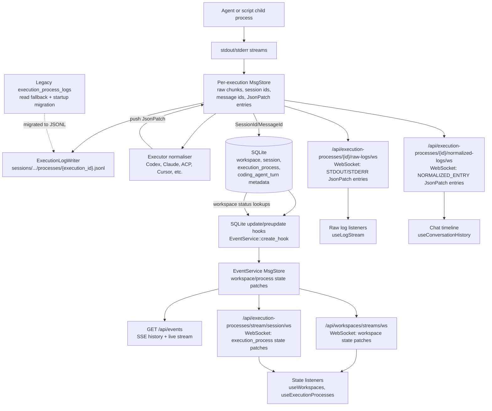

The live execution-log stores are held by the container service, not by the
individual executor adapters or by Axum. `crates/utils` defines the reusable
`MsgStore` type. `crates/local-deployment` owns the concrete
`LocalContainerService` instance with the `msg_stores` lookup map
(`Arc<RwLock<HashMap<ExecutionProcessId, Arc<MsgStore>>>>`).
`crates/services` exposes that map through the `ContainerService` trait and
implements the common `get_msg_store_by_id`, `stream_raw_logs`, and
`stream_normalized_logs` methods. Axum routes in `crates/server` call those
trait methods through `Deployment::container()`, so the lookup path is shared
across Codex, Claude, Cursor, ACP-style agents, scripts, and other executors.

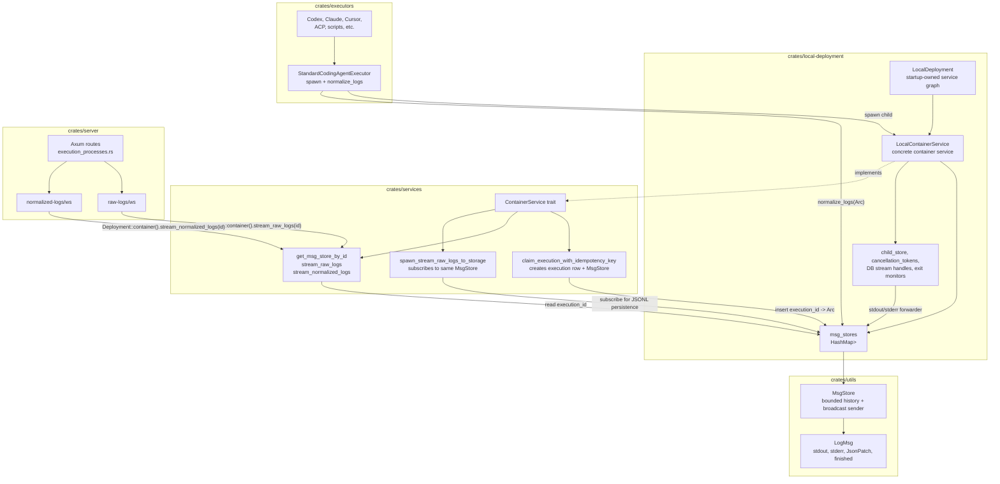

The main listener split is:

| Frontend listener | Endpoint and protocol | Payload shape | Intended data |
| --- | --- | --- | --- |
| `useLogStream` in process, script, and preview log views | `/api/execution-processes/{id}/raw-logs/ws` over WebSocket | `LogMsg::JsonPatch` entries whose values are `STDOUT` or `STDERR`, followed by `finished` | Raw execution logs for scripts, dev servers, and process-detail views. This stream does not carry normalised chat entries. |
| `useConversationHistory` for workspace chat timeline | `/api/execution-processes/{id}/normalized-logs/ws` over WebSocket | `LogMsg::JsonPatch` entries whose values are normalised conversation entries, followed by `finished` | Agent/review conversation history: assistant text, tool use, token usage, todos, questions, errors, and related normalised entries. Script processes are routed to the raw-log stream instead. |
| `useExecutionProcesses` via `ExecutionProcessesProvider` | `/api/execution-processes/stream/session/ws?session_id=...` over WebSocket | Initial `replace /execution_processes`, `Ready`, then add/replace/remove patches keyed by process id | Execution-process metadata for a session: status, timestamps, executor action, run reason, soft-delete state, and similar model fields. |
| `useWorkspaces` via `WorkspaceProvider` | `/api/workspaces/streams/ws?archived=...` over WebSocket | Initial `replace /workspaces`, `Ready`, then workspace add/replace/remove patches | Workspace list/cache state, including computed workspace status. |
| Legacy/global event consumers | `/api/events` over SSE | `LogMsg` encoded as SSE events, normally JSON patches from the EventService store | Global history + live state events from the SQLite hook bus. Current React state hooks use the filtered WebSocket endpoints above rather than `EventSource`. |

The SQLite update stream is not an execution-log stream. `DBService` installs
SQLite update and preupdate hooks for `workspaces`, `execution_processes`, and
`scratch`. For inserts and updates, SQLite gives the hook a `rowid`; the async
hook task reloads the changed row, converts the row into JSON Patch operations,
and pushes the patch into the `EventService` `MsgStore`. Add and replace patches
therefore carry the row payload, not only the row id. Deletes are handled by the
preupdate hook while old key values are still available, so remove patches carry
the identity needed to remove client-side state. Filtered WebSocket routes then
expose per-view slices of that patch bus, and `/api/events` exposes the same
store as SSE for global consumers.

#### EventService ownership, threading, and filtering

The global state-event store is an in-memory `utils::MsgStore`, not a durable
database table. `MsgStore` combines a bounded history buffer with a Tokio
`broadcast::Sender<LogMsg>`. Calling `push_patch` appends the patch to history
and broadcasts it to every current subscriber. New subscribers can therefore
receive an initial in-memory replay through `history_plus_stream`, while live
subscribers receive subsequent broadcasts through their own broadcast receiver.
The history is process-local and bounded by bytes, so SQLite remains the durable
source of truth for model state.

`crates/local-deployment` creates the shared event `MsgStore` during
`LocalDeployment::new`. It passes the same `Arc<MsgStore>` into
`EventService::create_hook` before opening the hooked `DBService`, then stores
it inside the long-lived `EventService`. `crates/services` owns the
`EventService` type and the patch-building logic. `crates/server` does not write
to the event store directly; routes ask the deployment for `events()` or
`stream_events()` and turn the returned `LogMsg` stream into SSE or WebSocket
frames.

The only normal producers for this global event store are SQLite hooks installed
by `EventService::create_hook`. The preupdate hook handles deletes while the old
row values are still available, producing remove patches for `workspaces`,
`execution_processes`, and `scratch`. The update hook handles inserts and
updates. Because SQLite invokes the hook synchronously on the connection thread,
the hook captures the current Tokio runtime handle and immediately spawns an
async task. That task reloads the affected row by `rowid`, builds the JSON Patch,
and calls `msg_store.push_patch`. Execution-process changes also trigger a
derived workspace-status patch so workspace lists update when process state
changes. This means the hook is the bridge from synchronous SQLite mutation
notification into the async broadcast bus.

Consumers register by subscribing to the `EventService` store, not by
registering with SQLite. `/api/events` uses `Deployment::stream_events`, which
exposes the store's history plus live stream as SSE without view-specific
filtering. The WebSocket routes for workspaces, execution processes, and scratch
state call `EventService` stream helpers instead. Each helper first queries
SQLite for a fresh snapshot, emits that snapshot as a `replace` patch, emits
`Ready`, and then subscribes to the shared broadcast receiver for live patches.

Filtering for model-state WebSockets is owned by these `EventService` stream
helpers in `crates/services/src/services/events/streams.rs`, with transport
handled by `crates/server`. Clients are not expected to consume a complete
unfiltered firehose for the main workspace and execution-process views.
`stream_workspaces_raw` filters by patch path and optional `archived` state,
converting some replacements to adds or removes so a filtered client cache stays
coherent when a workspace enters or leaves the current view.
`stream_execution_processes_for_session_raw` filters execution-process patches
by `session_id` and `show_soft_deleted`; remove patches that cannot be
session-verified are allowed through and the client cache ignores irrelevant
ids. `stream_scratch_raw` filters `/scratch` patches by scratch id and scratch
type embedded in the patch value. Frontend stores therefore receive view-shaped
patch streams, while the global store itself remains a coarse event bus for all
hooked table changes.

This global `EventService` store is separate from the per-execution `MsgStore`
instances kept by `LocalContainerService`. Per-execution stores are created when
an execution process is started and are written by executor stdout/stderr
forwarders and normalisers. They feed the raw and normalised log WebSockets:
`/api/execution-processes/{id}/raw-logs/ws` maps stdout/stderr messages into
raw log patches, while `/api/execution-processes/{id}/normalized-logs/ws`
streams the normalised conversation patches pushed by executor normalisers. The
global event store only carries model-state patches derived from SQLite hook
notifications.

Running execution-log streams read from memory first. If the process still has a
live `MsgStore`, both raw and normalised endpoints replay its in-memory history
and then continue with live broadcast messages. Once the live store is gone, the
raw endpoint reads the process JSONL file from disk and appends `finished`; if no
file exists it falls back to legacy `execution_process_logs` rows. Historical
normalised replay also starts from the JSONL raw messages, populates a temporary
`MsgStore`, reruns the executor normaliser, deduplicates the resulting patches,
and then emits `finished`.

### Threading and synchronization

Most backend concurrency is cooperative Tokio task concurrency. The process has
one Tokio runtime, Axum spawns a task per request/connection, and long-lived
services spawn additional tasks for event fan-out, process monitoring, diff
watching, relay registration, and cleanup. Blocking filesystem, git, shell,
tarball, PTY, and notification work is moved to Tokio's blocking pool with
`tokio::task::spawn_blocking` or, for a few callback-style integrations, a
dedicated `std::thread::spawn`.

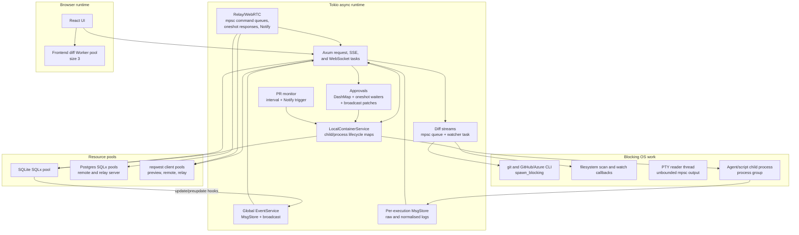

The main synchronization domains are:

| Domain | Cross-task or cross-thread boundary | Synchronization mechanism | Notes and contention risks |
| --- | --- | --- | --- |
| Server lifetime | `crates/server/src/main.rs` runs the main API listener and preview proxy listener as sibling tasks. | A process-wide `CancellationToken` is cloned into the deployment and listener graceful-shutdown futures. | Shutdown is cooperative. Tasks that own child tokens should stop when the root token is cancelled, while short spawned tasks may simply finish best-effort cleanup. |
| SQLite state events | SQLite update/preupdate hooks run synchronously on SQLx connection threads but need to publish async UI events. | `EventService::create_hook` captures the Tokio runtime handle and spawns an async patch-building task; `MsgStore` uses a `std::sync::RwLock` for bounded history and a Tokio `broadcast::Sender` for live subscribers. | Hook callbacks must stay small because they run on the SQLite connection thread. Row reload and patch fan-out happen after the hook returns, reducing the chance that a database connection waits on async subscribers. |
| Execution process lifecycle | Each agent or script has an OS child process, stdout/stderr forwarding, optional executor exit signal, DB log persistence, and an exit monitor. | `LocalContainerService` keeps `child_store`, `cancellation_tokens`, `msg_stores`, DB stream handles, and exit monitor handles in `Arc<tokio::sync::RwLock<HashMap<...>>>`. Executor completion uses `oneshot` exit signals plus `CancellationToken`s. | Process cleanup takes entries out of maps before awaiting long work where possible. The highest-risk area is nested access to child handles and lifecycle maps during stop/exit races, so new code should avoid holding a map lock while awaiting process IO, DB writes, or another service call. |
| Execution logs | Child stdout/stderr, executor protocol normalisers, JSONL persistence, raw-log WebSockets, and chat-log WebSockets all share per-execution state. | Per-execution `MsgStore` instances combine bounded in-memory history with `broadcast::Sender<LogMsg>`. Log persistence subscribes to the same store and exits on `LogMsg::Finished`. | Slow subscribers can lag and miss broadcast entries, but they get an error and the durable fallback is the JSONL file after process completion. |
| Approvals and questions | Executor adapters wait for UI approval responses while routes and WebSockets expose pending state. | `Approvals` stores pending/completed entries in `DashMap`, gives each request a `oneshot::Sender<ApprovalOutcome>`, and broadcasts JSON Patch updates on a bounded `broadcast::channel(64)`. Timeout watchers are spawned Tokio tasks. | This avoids holding a mutex across the executor wait. If approval patch subscribers lag, they receive a fresh pending snapshot. |
| Queued follow-ups | Users can submit a follow-up while a session is already running. | `QueuedMessageService` is an in-memory `DashMap<SessionId, QueuedMessage>`. Exit-monitor finalization consumes the queued message and starts the next execution. | The queue is process-local and intentionally one item per session. The DB remains the durable source for execution records; queued drafts are not a multi-item durable work queue. |
| Auth, config, relay credentials, and profile caches | Request handlers and background tasks share mutable configuration and auth state. | Mostly `Arc<tokio::sync::RwLock<...>>`; auth refresh has a `tokio::sync::Mutex<()>` guard so only one refresh runs at a time. | Treat these locks as short critical sections around in-memory data. Do not hold them while making remote HTTP requests unless the code explicitly needs to serialize that request. |
| Diff and filesystem streams | Diff views combine file-watcher callbacks, periodic git checks, and git diff computation. | `diff_stream` sends `LogMsg`s through a bounded `mpsc::channel(1000)`, stores sent-file metadata in `std::sync::RwLock`s, uses `watch::channel(())` for git state notifications, and aborts the watcher task when `DiffStreamHandle` is dropped. Filesystem repo scans use a `CancellationToken` soft timeout plus `JoinHandle::abort` hard timeout. | Backpressure is local to each diff stream. Heavy git operations run in the blocking pool so they do not pin async workers. |
| PTY terminal sessions | Terminal routes interact with blocking PTY readers and writers. | `PtyService` uses `Arc<std::sync::Mutex<HashMap<Uuid, PtySession>>>`; session creation runs in `spawn_blocking`; each PTY reader uses a dedicated OS thread and forwards bytes over an unbounded Tokio `mpsc` receiver. | The synchronous mutex protects portable-pty handles. Keep writes/resizes short; avoid adding async awaits while holding the mutex. |
| Relay and WebRTC | Relay host/client code multiplexes HTTP requests and WebSocket streams over data channels and SSH tunnels. | Relay control uses `CancellationToken` child tokens. WebRTC clients use bounded `mpsc` command and data-channel queues, per-request `oneshot` response waiters, `tokio::sync::Mutex<HashMap<...>>` pending maps, and `Notify` for connection-open wakeups. Relay signing sessions use an `RwLock<HashMap<...>>`. | Pending maps are locked briefly to insert/remove waiters. Data-channel request timeouts prevent permanent waits. TunnelManager serializes tunnel creation with a mutex and double-checks before inserting an active tunnel. |
| Remote/cloud services | The remote API and relay server are separate Axum processes backed by Postgres. | SQLx `PgPool`s are configured with `max_connections(10)` in both `crates/remote` and relay server DB setup. Request transaction metadata is propagated with a Tokio task-local `TX_CONTEXT`. | The pool size is the primary remote-side concurrency limit in this code. ElectricSQL and Postgres handle cross-process synchronization; app code should keep transactions scoped tightly. |
| Preview proxy and HTTP clients | Preview iframe traffic and relay fallback requests proxy to local or remote HTTP/WebSocket targets. | `PreviewProxyService` owns a cloneable reqwest `Client`; WebSocket proxying delegates to bridge helpers. Reqwest manages its own connection pool. | There is no app-level preview lock. Backpressure and connection reuse are handled by Hyper/reqwest and the WebSocket bridge tasks. |
| Frontend diff rendering | Large file diffs are parsed/highlighted off the main browser thread. | `ChangesPanelContainer` creates a `WorkerPoolContextProvider` for `@pierre/diffs` with `poolSize: 3`. | This is the only explicit frontend thread pool found in the app code search. |

No explicit Tokio semaphores or barriers are currently used in the searched
backend and frontend code. The practical concurrency limits are therefore the
SQLx connection pools, bounded broadcast/mpsc queues, Tokio's blocking-thread
pool, the browser worker pool, and external services or child processes.

Potential deadlock patterns to avoid:

- Do not hold `tokio::sync::RwLock` or `Mutex` guards across calls that can
  re-enter the same service, wait on child processes, perform DB work, or await
  network IO.
- Do not call async code from SQLite hook callbacks. Use the existing runtime
  spawn bridge so SQLite connection threads are not blocked by async work.
- Keep `std::sync` locks in `MsgStore`, PTY sessions, filesystem watcher
  state, and executor caches small and non-async. These locks are safe because
  current code only guards in-memory structures or synchronous handles.
- Prefer bounded channels for new long-lived streams unless losing
  backpressure is intentional. Existing unbounded channels are used for PTY
  output and some executor protocol/control paths where the producer is tied to
  a local process or protocol callback.

### Preview proxy flow

Preview traffic is separate from normal API traffic. The main server exposes
preview configuration APIs, while the preview listener uses
`PreviewProxyService` to route browser requests to the dev-server process
running inside a workspace.

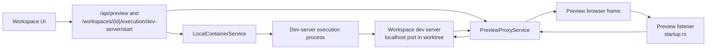

## Executor architecture

Executors are adapters around coding-agent CLIs and protocols. The backend
stores the desired action as an `ExecutorAction`, resolves it through
`ExecutorConfigs`, and then calls the `StandardCodingAgentExecutor` trait
implemented by each agent. The container service owns process lifecycle,
workspace paths, approval bridges, environment injection, log capture, and
durable execution records.

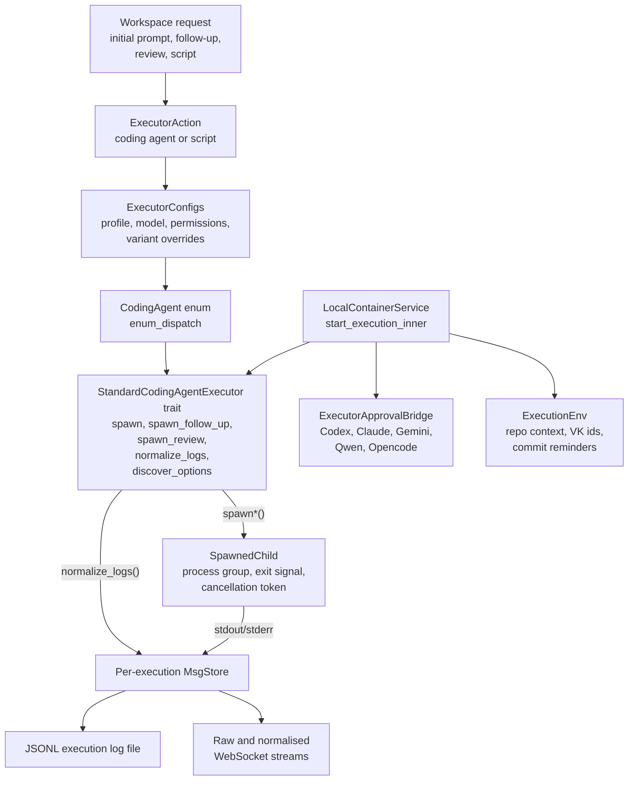

### Executor adapters

Most adapters share the same container contract, but differ in how they launch
the agent, resume sessions, request approvals, and translate native output into
normalised conversation entries.

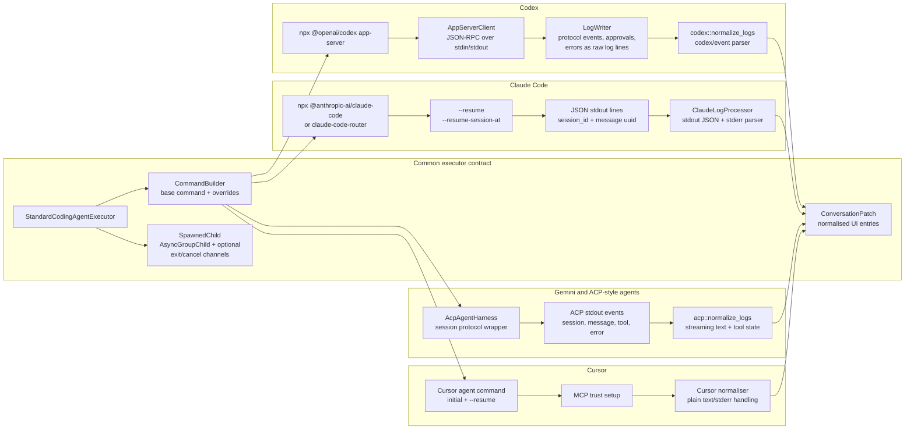

Codex runs as an app-server subprocess and uses a JSON-RPC client inside the
executor adapter. The adapter starts or forks Codex threads, forwards approval
requests through Vibe Kanban's approval bridge, writes Codex protocol events
back into the captured log stream, and normalises `codex/event` notifications
for the conversation UI.

Claude Code runs as a CLI process that emits structured JSON lines on stdout.
The Claude adapter builds initial and resumed commands, supports
`--resume-session-at` for resetting to a previous message, extracts Claude
session and message identifiers from the JSON stream, and normalises both
stdout JSON and stderr into conversation entries.

Gemini uses the shared ACP harness and normaliser. The harness manages
agent-client-protocol sessions, while the ACP normaliser turns session,
message, tool-call, and error events into streaming conversation patches.

Cursor follows the same trait contract with Cursor-specific command building,
resume arguments, MCP trust setup, and log normalisation. Its normaliser handles
plain text and stderr-oriented output, including login and setup errors.

## Frontend architecture

The detailed frontend architecture, including app shells, feature modules, local
and remote entrypoints, connection ownership, and workspace data flows, lives in
[Frontend architecture](frontend-architecture.md).

## Runtime flow

1. The server starts, creates the asset directory, migrates SQLite, initialises `LocalDeployment`, and binds the main API listener and preview proxy listener.
2. The frontend loads from the local server in production or from Vite in development.
3. UI features call `/api` routes for projects, workspaces, sessions, git operations, previews, approvals, terminal access, and configuration.
4. Backend routes delegate through the `Deployment` trait to database, git, filesystem, executor, event, preview, remote, and relay services.
5. A workspace creates or reuses git worktrees, starts agent or script processes, stores execution metadata in SQLite, persists raw execution logs as JSONL files, and streams raw logs, normalised conversation patches, and state changes back to the UI.
6. Optional cloud configuration enables remote project, issue, host pairing, relay, and sync flows through `crates/remote` and the relay crates.
