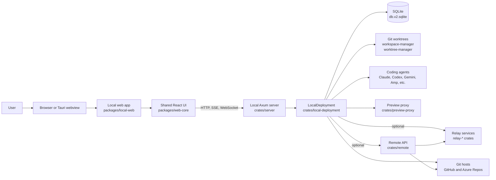
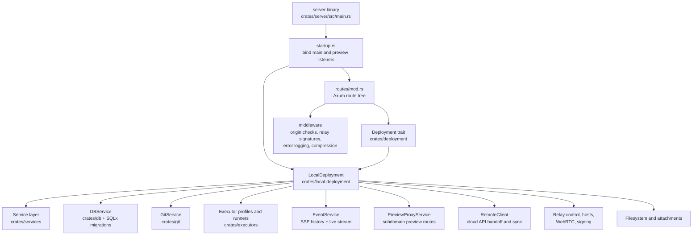
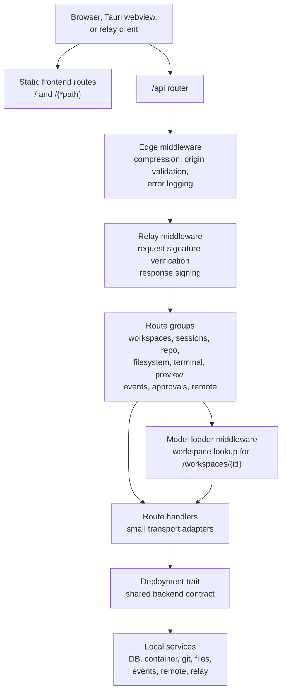
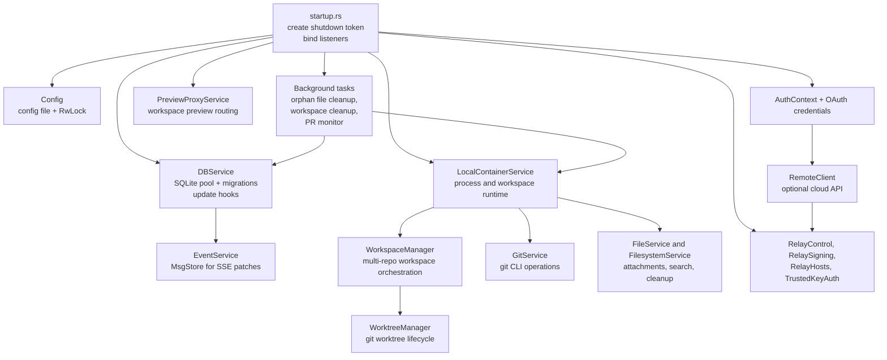
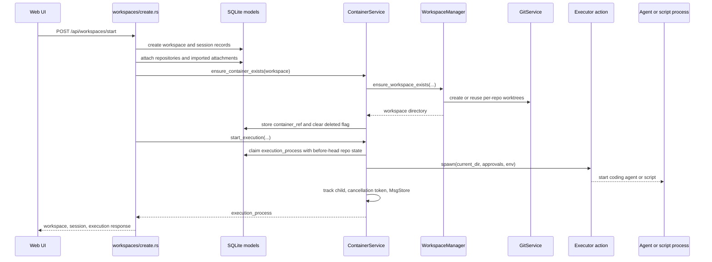
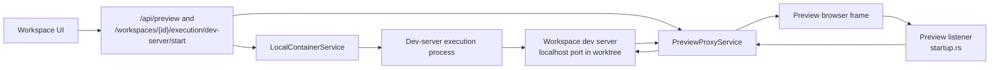
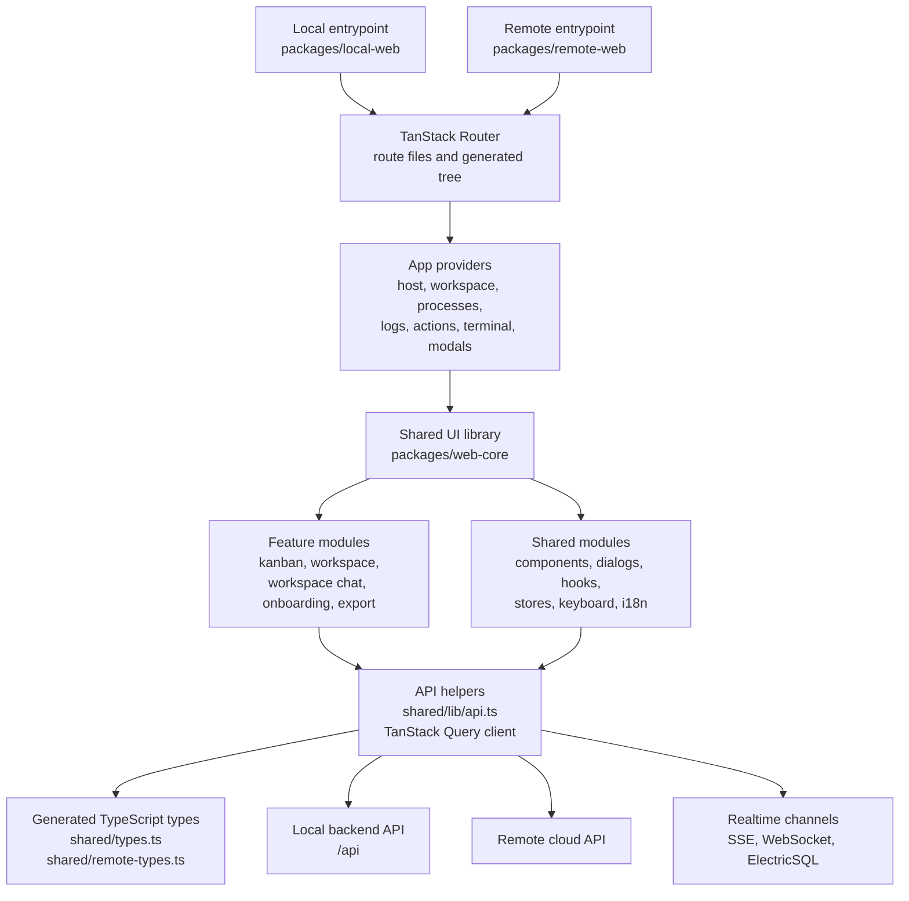

## Overview

Vibe Kanban is a local-first application with optional cloud and relay services. The local app serves a React frontend, exposes an Axum API, stores state in SQLite, manages git worktrees, runs coding agents as child processes, and proxies preview traffic from workspace dev servers.

The remote deployment adds organisation, issue, attachment, GitHub App, ElectricSQL, and relay-facing services for Vibe Kanban Cloud. Local installations can connect to those services when the shared API and relay endpoints are configured.

## Backend architecture

The backend is split between transport, deployment wiring, service logic, and persistence. `crates/server` owns startup and Axum routing. `crates/deployment` defines the shared `Deployment` trait used by routes and services. `crates/local-deployment` builds the concrete local deployment by initialising configuration, SQLite, git, file storage, event streaming, approvals, executor state, relay state, and preview services.

### Backend request layers

Most HTTP traffic enters through the Axum router in `crates/server`. The route
tree keeps transport concerns at the edge, loads request-scoped models where
needed, and delegates all durable behaviour through the `Deployment` interface.

### Local deployment composition

`LocalDeployment::new` wires long-lived services once at startup. The same
deployment instance is cloned into every route, so handlers share service
handles while each service keeps its own internal locks, background tasks, and
connection pools.

### Workspace creation and execution flow

Creating and starting a workspace crosses three boundaries: the route creates
durable database records, the container service claims an execution, and the
local container implementation prepares worktrees before spawning the selected
agent or script process.

### Execution logs and live updates

Execution output uses a per-process `MsgStore` before being normalised and
persisted. Database writes then trigger SQLite hooks registered by
`EventService`, which convert changed rows into JSON patches for the global
SSE stream consumed by the frontend.

```mermaid
flowchart LR
  Child["Agent or script child process"]
  Stdout["stdout/stderr streams"]
  ProcessMsgStore["Per-execution MsgStore\nraw and normalised log entries"]
  LogPersister["DB stream task\nexecution_process logs"]
  DB[("SQLite\nexecution_processes,\nturns, scratch,\nworkspaces")]
  UpdateHook["SQLite update/preupdate hooks\nEventService::create_hook"]
  GlobalMsgStore["EventService MsgStore\nhistory + live patches"]
  SSE["GET /api/events\nSSE keep-alive stream"]
  UI["Frontend query cache\nworkspace and process state"]

  Child --> Stdout
  Stdout --> ProcessMsgStore
  ProcessMsgStore --> LogPersister
  LogPersister --> DB
  DB --> UpdateHook
  UpdateHook --> GlobalMsgStore
  GlobalMsgStore --> SSE
  SSE --> UI
  DB -->|"workspace status lookups"| UpdateHook
```

### Preview proxy flow

Preview traffic is separate from normal API traffic. The main server exposes
preview configuration APIs, while the preview listener uses
`PreviewProxyService` to route browser requests to the dev-server process
running inside a workspace.

## Frontend architecture

The frontend has thin app entrypoints and a larger shared UI package. `packages/local-web` provides the local Vite shell, TanStack Router route files, and app-level providers. `packages/remote-web` provides the cloud entrypoint. `packages/web-core` contains the shared features, dialogs, hooks, stores, API helpers, keyboard handling, onboarding, workspace UI, kanban UI, and shared layouts used by both app shells.

## Runtime flow

1. The server starts, creates the asset directory, migrates SQLite, initialises `LocalDeployment`, and binds the main API listener and preview proxy listener.
2. The frontend loads from the local server in production or from Vite in development.
3. UI features call `/api` routes for projects, workspaces, sessions, git operations, previews, approvals, terminal access, and configuration.
4. Backend routes delegate through the `Deployment` trait to database, git, filesystem, executor, event, preview, remote, and relay services.
5. A workspace creates or reuses git worktrees, starts agent or script processes, stores execution metadata, and streams logs and state changes back to the UI.
6. Optional cloud configuration enables remote project, issue, host pairing, relay, and sync flows through `crates/remote` and the relay crates.
