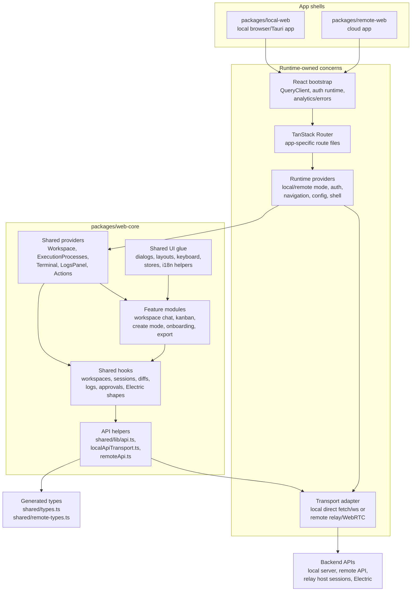
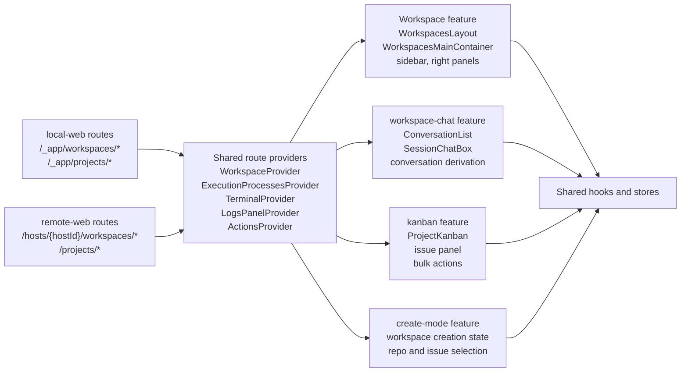
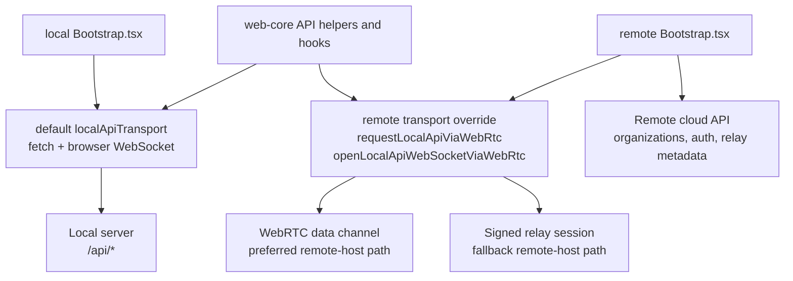
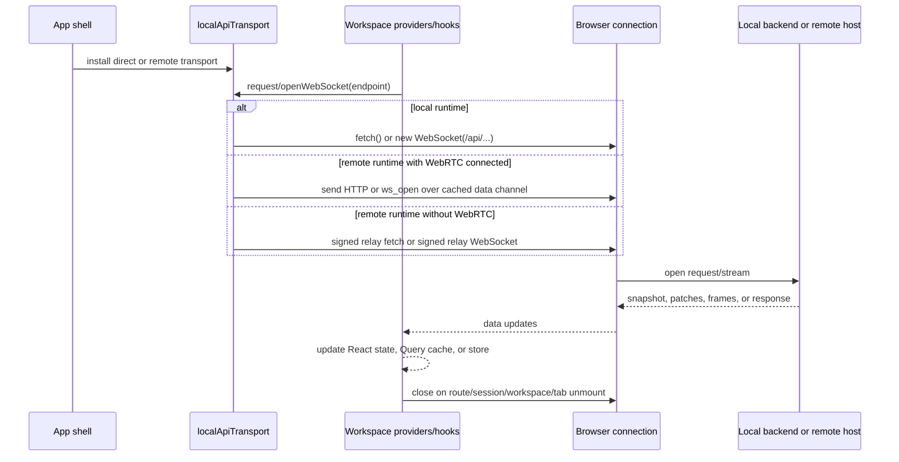
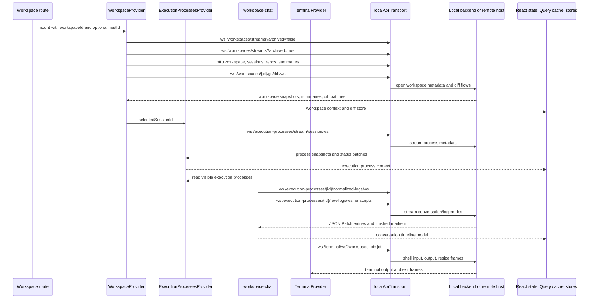

## Overview

The frontend is split into app shells and shared feature modules. The app shells
in `packages/local-web` and `packages/remote-web` own runtime-specific startup,
route trees, top-level providers, navigation, authentication, and transport
adapters. The shared application experience lives in `packages/web-core`: it
contains the workspace UI, kanban UI, workspace chat, create flow, export flow,
dialogs, hooks, stores, API helpers, keyboard handling, and shared layouts.

## Apps and Feature Modules

Apps are deployable entrypoints. They decide where the frontend is running and
which runtime services are available.

`packages/local-web` is the local app shell. It starts the React app, configures
Sentry, PostHog, Tauri-specific listeners and zoom handling, local auth runtime,
local navigation, the local route tree, local config/theme providers, and the
full `_app` provider stack used by local workspace routes.

`packages/remote-web` is the cloud app shell. It starts the React app,
configures remote auth and API bases, installs the local API transport override
that sends host-scoped local API calls through WebRTC or relay, owns cloud
account/invitation routes, and renders the remote app shell and host navigation.

Feature modules are reusable product areas inside `packages/web-core`. They do
not decide how the backend is reached. They consume shared providers and API
helpers, so the same workspace, chat, diff, terminal, and kanban components can
run against the local backend directly or against a remote host selected by the
cloud shell.

## Entrypoints

Local and remote have separate browser entrypoints and separate route trees, but
they converge on `web-core` for product features.

| Runtime            | Browser entrypoint                                | Router/root                                                                     | Backend entrypoint                                                                                                                                                              |
| ------------------ | ------------------------------------------------- | ------------------------------------------------------------------------------- | ------------------------------------------------------------------------------------------------------------------------------------------------------------------------------- |
| Local web or Tauri | `packages/local-web/src/app/entry/Bootstrap.tsx`  | `packages/local-web/src/app/entry/App.tsx`, `packages/local-web/src/routes/*`   | Direct `/api` and direct WebSocket URLs on the local server. In Vite development, `/api` is proxied to `BACKEND_PORT`.                                                          |
| Remote cloud       | `packages/remote-web/src/app/entry/Bootstrap.tsx` | `packages/remote-web/src/app/entry/App.tsx`, `packages/remote-web/src/routes/*` | Remote API for cloud/account data. Host-scoped local API calls use `setLocalApiTransport` and go through WebRTC when available, otherwise signed relay HTTP/WebSocket sessions. |

The backend-facing path also differs by scope. Local workspace routes call
`/api/...`. Host-scoped routes use `/api/host/{hostId}/...` in shared hooks, or
the remote transport resolves the active host from `/hosts/{hostId}/...` and
sends the same logical request to that host through WebRTC or relay.

## Connection Ownership

Most frontend connections are opened by hooks or providers close to the UI data
they own. The app shell only chooses the transport implementation.

| Connection                                             | Owner                                                       | Lifetime                                                                                                                                                                                                                                          | Shares transport with                                                                                                                                            |
| ------------------------------------------------------ | ----------------------------------------------------------- | ------------------------------------------------------------------------------------------------------------------------------------------------------------------------------------------------------------------------------------------------- | ---------------------------------------------------------------------------------------------------------------------------------------------------------------- |
| Workspace lists                                        | `useWorkspaces` inside `WorkspaceProvider`                  | Two JSON Patch WebSockets while the provider is mounted: active and archived workspaces. Reconnects via `useJsonPatchWsStream`.                                                                                                                   | Same local API transport as other workspace WebSockets; separate WebSocket instances.                                                                            |
| Workspace record, sessions, repos, summaries, comments | TanStack Query hooks used by `WorkspaceProvider`            | Query lifetime and invalidation rules; summaries also poll every 15 seconds after stream initialization.                                                                                                                                          | HTTP through `makeLocalApiRequest`.                                                                                                                              |
| Diff stream                                            | `useDiffStream` inside `WorkspaceProvider`                  | One JSON Patch WebSocket for the selected workspace, closed when the workspace changes or provider unmounts.                                                                                                                                      | Same local API transport; separate WebSocket from chat/log streams.                                                                                              |
| Execution process stream                               | `useExecutionProcesses` inside `ExecutionProcessesProvider` | One JSON Patch WebSocket for the selected session, closed when the session changes.                                                                                                                                                               | Same local API transport; separate WebSocket.                                                                                                                    |
| Conversation history                                   | `useConversationHistory` in workspace chat                  | One raw or normalized log WebSocket per execution process being loaded or followed. Running processes keep streaming until the backend sends `finished`. Historic processes are loaded, closed, and kept in memory for the conversation timeline. | Uses `streamJsonPatchEntries`, which uses the same local API WebSocket transport. Does not share a socket with process metadata.                                 |
| Raw logs                                               | `useLogStream` in logs, preview, task details, and actions  | One raw-log WebSocket for the selected process. It reconnects with bounded backoff and stops after a finished message.                                                                                                                            | Same raw log backend endpoint as script conversation history, but opened as its own socket.                                                                      |
| Terminal                                               | `TerminalProvider` and `XTermInstance`                      | One WebSocket per terminal tab. Connections are stored in provider refs, reconnect with backoff, and close when the tab/workspace is closed or the provider unmounts.                                                                             | Same local API transport; separate WebSocket per tab.                                                                                                            |
| Electric shapes                                        | `useShape` and `createShapeCollection`                      | Collection-scoped Electric subscription for remote/cloud data, with fallback polling when Electric is unavailable.                                                                                                                                | Remote API/auth runtime, not local workspace WebSockets.                                                                                                         |
| Remote host tunnel                                     | `remote-web` WebRTC transport and relay helpers             | Cached per host by `connectionManager`. Failed WebRTC attempts cool down; relay HTTP/WebSocket is used while WebRTC is unavailable.                                                                                                               | All host-scoped HTTP and WebSocket traffic can ride the same WebRTC data channel once connected. Relay fallback opens request-specific HTTP calls or WebSockets. |

`useJsonPatchWsStream` is the common lifecycle manager for most JSON Patch
WebSocket streams. It initializes local state, opens the socket, applies
incoming JSON Patch operations with structural sharing, exposes connection and
initialization state, reconnects with exponential backoff after unexpected
closures, and treats `finished` or clean close as terminal.

The remote host transport adds another layer of connection management. Remote
bootstrap calls `setLocalApiTransport`, so `web-core` continues to call
`makeLocalApiRequest` and `openLocalApiWebSocket`. The remote implementation
first tries `getWebRtcConnection(hostId)`. A connected WebRTC data channel can
carry multiple logical HTTP requests and WebSocket streams. If the data channel
is missing, connecting, failed, or a request fails, the same logical request
falls back to signed relay HTTP or signed relay WebSocket.

## Workspace Open Data Flow

Opening a workspace starts a small set of independent data flows. They are
coordinated by providers, but they do not all share one connection.

The main workspace data types are:

| Data type                                | Frontend owner                            | Transport                                    | Notes                                                                                |
| ---------------------------------------- | ----------------------------------------- | -------------------------------------------- | ------------------------------------------------------------------------------------ |
| Workspace list and status                | `useWorkspaces`                           | JSON Patch WebSockets                        | Active and archived lists are separate streams.                                      |
| Workspace detail, sessions, repos        | `WorkspaceProvider` query hooks           | HTTP                                         | Cached by TanStack Query and refreshed by invalidation or polling where needed.      |
| File diffs and diff stats                | `useDiffStream`                           | JSON Patch WebSocket                         | Stored into `useWorkspaceDiffStore` after `requestAnimationFrame` batching.          |
| Execution process metadata               | `ExecutionProcessesProvider`              | JSON Patch WebSocket                         | Drives running state, process list, and which log streams chat should open.          |
| Chat/conversation entries                | `workspace-chat` `useConversationHistory` | Per-process raw or normalized log WebSockets | Normalized agent output is used for chat; script output uses raw logs.               |
| Raw logs                                 | `useLogStream` consumers                  | Per-process raw-log WebSocket                | Used by logs panels, preview diagnostics, scripts, and actions.                      |
| Terminal input/output                    | `TerminalProvider` and `XTermInstance`    | Per-tab terminal WebSocket                   | Sends input and resize messages; receives base64 output and exit messages.           |
| Remote project, issue, notification data | `useShape` users                          | Electric shape subscription with fallback    | Used for cloud/remote project and issue data; distinct from local workspace streams. |

In local runtime, these connections go directly to the local Axum server. In
remote runtime, the same logical streams are host-scoped and are carried through
the remote transport. When WebRTC is connected, multiple logical HTTP and
WebSocket flows share the same per-host data channel. When relay fallback is in
use, each logical WebSocket is its own signed relay WebSocket.
